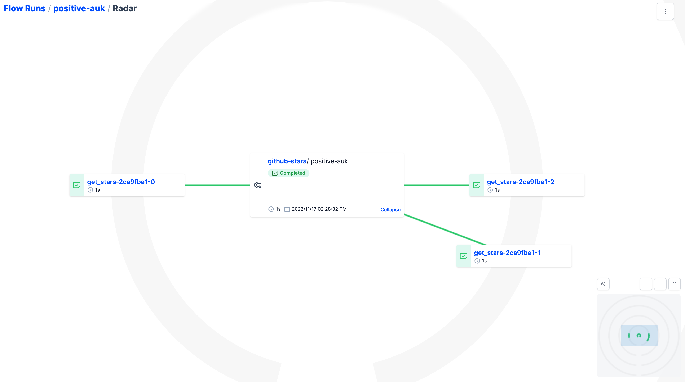

Run a flow locally
```
python flows/1_github_stars.py
```

Start the prefect local UI
```
prefect orion start
```

Go and explore the flow run we just created. Go and check the logs, the parameters that were passed, etc.

In the flow runs panel, try to find the radar view and observe the execution in parallel of the different star processes.



Now let's start with a basic flow!
```
python flows/2_basic_flow.py
```

Run flows using parameters

```
python flows/3_flows_with_parameters.py
```

Run a basic flow with a task

```
python flows/4_basic_flow_with_tasks.py
```

Run a flow with cascading tasks. Make sure to go in the UI and look at the resulting radar!

```
python flows/5_cascading_tasks.py
```

Now, let's have a look at how we can launch flows within flows. This is useful when you might have flows that can fail and that should be relaunched independently.

```
python flows/6_flow_withing_flow.py
```

It's easy to leverage retries with tasks, run the following flow that is expected to fail, and go have a look in the Orion UI to see the result!

```
python flows/7_failing_flow_with_retries.py
```

To see how caching works for tasks, run the following flow a few times, and notice how Mario Bros in only welcomed once.

```
python flows/8_task_caching.py
```

Now that we have tried a few of Prefect 2 features, let's try to build a deployment that will allow us to run flows in multiple infrastructure

```
prefect deployment build ./flows/9_github_stars_deployment.py:github_stars -n github-stars -q tutorial
```

You'll notice this created a github_stars-deployment.yaml file at the root of the repository. Open it and go modify the parameters and the schedule to setup a deployment that would print the number of stars for the https://github.com/PrefectHQ/prefect every minutes.

```
parameters: {}
schedule: null
```
 
Modify these 2 lines to the following:

```
parameters: {
  "repos": ["PrefectHQ/prefect"]
}
schedule:
  interval: 300
```

Now, let's apply this deployment so that Prefect Orion registers it.

```
prefect deployment apply github_stars-deployment.yaml
```

Note that this deployment will be trying to run the flow every minute using the 'tutorial' work queue. You will notice in the 'Runs' tab that a some of tje runs will be tagged as 'Late' if you don't start an agent to consume the work queue.

If you go in the Work Queues navigation in the UI, you'll see that that the 'tutorial' work queue is unhealthy because no agent is consuming it.

To make sure we can run this flow on schedule properly, let's create start an agent!

```
prefect agent start -q 'tutorial'
```

Now, go in the Deployments navigation in the UI, select the 'github-stars' deployment and run it using the defaults.
You should see the local agent on your computer picking up the flow, and running it. Go in the UI, and take a look at the execution logs.

Now, go and click on the 'Run' button again, and try to find the numbers of stars of 'freeCodeCamp/freeCodeCamp', which is the most popular repository on Github.


